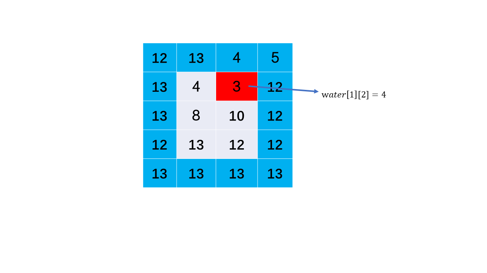
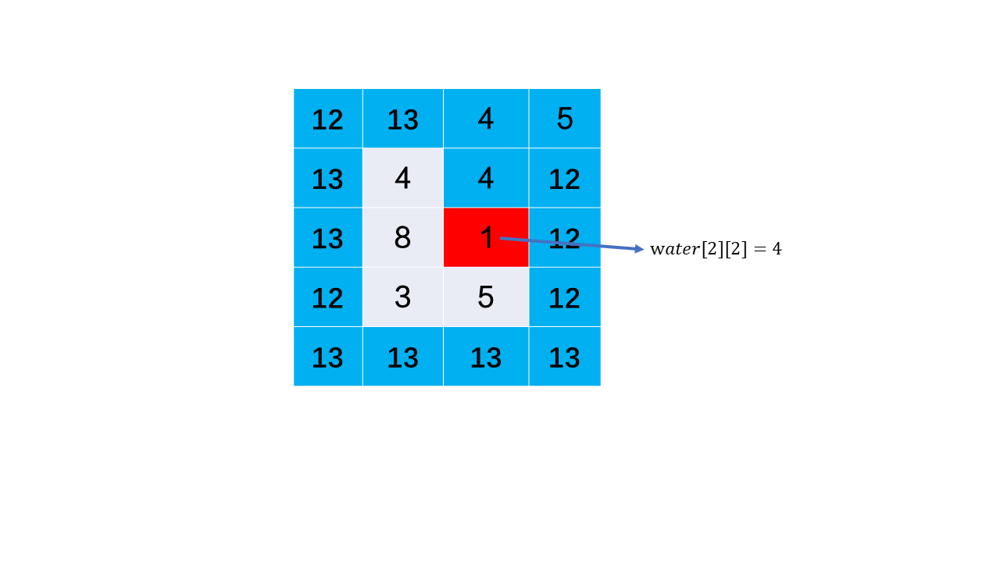

# P407 接雨水 II

- [P407 接雨水 II](#p407-接雨水-ii)
  - [思路与算法](#思路与算法)

最小堆

## 思路与算法

首先我们思考一下什么样的方块一定可以接住水：

- 该方块不为最外层的方块；
- 该方块自身的高度比其上下左右四个相邻的方块 **接水后** 的高度都要低；

设方块的索引为 )

方块高度为

则方块接水后的高度为:

,min(water[i-1][j],water[i+1][j],water[i][j-1],water[i][j+1]))

方块 ) 实际接水容量为 

矩阵的最外层的方块接水后的高度就是方块的自身高度，因为最外层的方块无法接水，因此最外层的方块 

根据木桶原理，接到的雨水的高度由这个容器周围最短的木板来确定的。我们可以知道容器内水的高度取决于最外层高度最低的方块。



我们假设已经知道最外层的方块接水后的高度的最小值，则此时我们根据木桶原理，肯定可以确定最小高度方块的相邻方块的接水高度。我们同时更新最外层的方块标记，我们在新的最外层的方块再次找到接水后的高度的最小值，同时确定与其相邻的方块的接水高度



然后再次更新最外层，依次迭代直到求出所有的方块的接水高度，即可知道矩阵中的接水容量。

```java
class Solution {
    public int trapRainWater(int[][] heightMap) {
        int m = heightMap.length;
        int n = heightMap[0].length;
        if (m < 3 || n < 3) {
            return 0;
        }
        // 从小到大输出
        PriorityQueue<int[]> queue = new PriorityQueue<>((Comparator.comparingInt(o -> o[2])));
        boolean[][] visited = new boolean[m][n];
        for (int i = 0; i < m; i++) {
            for (int j = 0; j < n; j++) {
                //将最外圈的元素放入优先队列，同时标记已经访问
                if (i == 0 || i == m - 1 || j == 0 || j == n - 1) {
                    queue.offer(new int[]{i, j, heightMap[i][j]});
                    visited[i][j] = true;
                }
            }
        }
        int ans = 0;
        // x+dir[i] y+dir[i+1]
        //  i = 0, x-1,y+0 左
        //  i = 1, x,y+1 右
        // i = 2, x+1 ,y+0 下
        // i = 3, x, y-1 上
        int[] dir = {-1, 0, 1, 0, -1};
        //循环从pq取出元素，遍历其左上右下结点，如果找到比他小的内部节点，就灌水到等高
        while (!queue.isEmpty()) {
            int[] cur = queue.poll();
            for (int k = 0; k < 4; k++) {
                int nx = cur[0] + dir[k];
                int ny = cur[1] + dir[k + 1];
                if (nx >= 0 && nx < m && ny > 0 && ny < n && !visited[nx][ny]) {
                    int temp = cur[2] - heightMap[nx][ny];
                    if (temp > 0) {
                        ans += temp;
                    }
                    queue.offer(new int[]{nx, ny, Math.max(heightMap[nx][ny], cur[2])});
                    visited[nx][ny] = true;
                }
            }
        }
        return ans;
    }
}
```