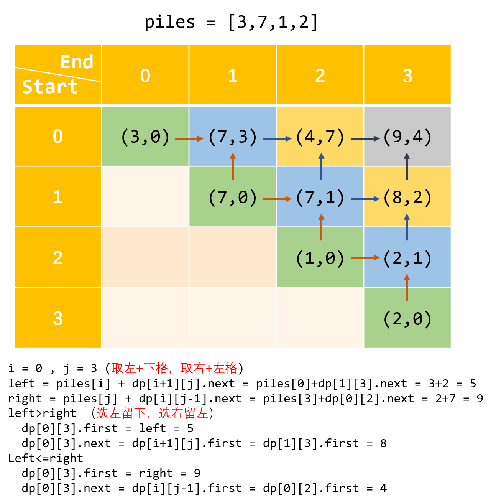

# 博弈问题

- [博弈问题](#博弈问题)
  - [三个概念](#三个概念)
  - [最优策略](#最优策略)
  - [例题](#例题)
  - [实际 => 动态规划](#实际--动态规划)
    - [定义dp数组的含义](#定义dp数组的含义)
    - [状态转移方程及其 base case](#状态转移方程及其-base-case)
    - [代码实现](#代码实现)

## 三个概念

对于特定状态，如果游戏已经结束，则根据结束时的状态决定：

1. **必胜状态** ：从特定状态开始，如果存在一种操作将状态变成必败状态，则当前玩家可以选择该操作，将必败状态留给对方玩家，因此该特定状态对于当前玩家为必胜状态
2. **必败状态** ：从特定状态开始，如果所有操作都会将状态变成必胜状态，则无论当前玩家选择哪种操作，都会将必胜状态留给对方玩家，因此该特定状态对于当前玩家为必败状态。
3. **必和状态** ：从特定状态开始，如果任何操作都不能将状态变成必败状态，但是存在一种操作将状态变成必和状态，则当前玩家可以选择该操作，将必和状态留给对方玩家，因此该特定状态对于双方玩家都为必和状态。

## 最优策略

对于每个玩家，最优策略如下：

- 争取将必胜状态留给自己，将必败状态留给对方玩家。
- 在自己无法到达必胜状态的情况下，争取将必和状态留给自己。

---

## 例题

|难度|题目|代码|掌握度|
|:---:|:---|:---|:---:|
|💛 |[P486_预测赢家](./../content/P486_PredictTheWinner.md) |[P486_PredictTheWinner.java](./../../P486_PredictTheWinner.java)|😄|
|💛 |[P877_石子游戏](./../content/P877_StoneGame.md) |[P877_StoneGame.java](./../../P877_StoneGame.java)|😄|
|❤️ |[P913_猫和老鼠](./../content/P913_CatAndMouse.md) |[P913_CatAndMouse.java](./../../P913_CatAndMouse.java)|🤯🤯🤯|

更普遍的。

用数组 piles表示钱堆。piles[i] 表示第 i 堆有多少钱。 两个人轮流拿钱，一次只能拿一堆钱，且只能拿走最左边或者最右边的钱。 所有的钱拿完之后，谁拥有的钱最多，谁获胜。

假设两人都很聪明，请你设计一个算法，返回先手和后手的最后得分（金额总数）之差。

示例1：

```text
piles = [3,7,1,2]
ans = 5

解释: 
A -> 2，剩下 [3,7,1]
B -> 3，剩下 [7,1]
A -> 7，剩下 [1]
B -> 1，剩下 []
A - B = 2 + 7 - (3 + 1) = 5
```

---

## 实际 => 动态规划

博弈问题可以转化为动态规划问题。需要明确两个维度：

1. 定义dp数组的含义
2. 状态转移方程及其 base case

### 定义dp数组的含义

博弈问题的前提一般都是在两个聪明人之间进行，编程描述这种游戏的一般方法是二维 dp 数组，数组中通过元组分别表示两人的最优决策。

之所以这样设计，是因为 **先手在做出选择之后，就成了后手，后手在对方做完选择后，就变成了先手** 。这种角色转换使得我们可以重用之前的结果，典型的动态规划标志。

定义元组，先手（move first，简称 `first`）和后手（move next，简称 `next`）

```java
class Pair {
    int first;
    int next;

    public Pair(int first, int next) {
        this.first = first;
        this.next = next;
    }
}
```

对于dp[i][j] 的含义解释

```text
dp[i][j].first 表示，对于 piles[i...j] 这部分石头堆，先手能获得的最高分数。
dp[i][j].next 表示，对于 piles[i...j] 这部分石头堆，后手能获得的最高分数。

举例理解一下，假设 piles = [3, 7, 1, 2]，索引从 0 开始
dp[0][1].first = 7 意味着：面对石头堆 [3, 7]，先手最终能够获得 7 分。
dp[1][3].next = 2 意味着：面对石头堆 [7, 1, 2]，后手最终能够获得 2 分。
```

最终结果为 `dp[0][n-1].first - dp[0][n-1].next`

### 状态转移方程及其 base case

首先要找到所有「状态」和每个状态可以做的「选择」，然后择优。

根据前面对 dp 数组的定义，状态显然有三个：开始的索引 i，结束的索引 j，当前轮到的人。

```text
dp[i][j][first or next]
其中：
0 <= i < piles.length
i <= j < piles.length
```

对于这个问题的每个状态，可以做的 **选择有两个：选择最左边的那堆，或者选择最右边的那堆** 。 我们可以这样穷举所有状态

```text
n = piles.length
for 0 <= i < n:
    for j <= i < n:
        for who in {first, next}:
            dp[i][j][who] = max(left, right)
```

这道题的难点在于，两人是交替进行选择的，也就是说先手的选择会对后手有影响，这怎么表达出来呢？

写出状态转移方程：

```bash

# 我作为先手，面对 piles[i...j] 时，有两种选择：
# 要么我选择最左边的那一堆，然后面对 piles[i+1...j]
# 但是此时轮到对方，相当于我变成了后手；
# 要么我选择最右边的那一堆，然后面对 piles[i...j-1]
# 但是此时轮到对方，相当于我变成了后手。
dp[i][j].first = max(选择最左边的堆,选择最右边的堆)
               = max(piles[i] + dp[i+1][j].next, piles[j] + dp[i][j-1].next)


# 我作为后手，要等先手先选择，有两种情况：
# 如果先手选择了最左边那堆，给我剩下了 piles[i+1...j]
# 此时轮到我，我变成了先手；
# 如果先手选择了最右边那堆，给我剩下了 piles[i...j-1]
# 此时轮到我，我变成了先手。
if 先手选择左边:
    dp[i][j].first = left;
    dp[i][j].next = dp[i+1][j].first
if 先手选择右边:
    dp[i][j].first = right;
    dp[i][j].next = dp[i][j-1].first
```

根据 dp 数组的定义，我们也可以找出 base case，也就是最简单的情况：

```bash
# i 和 j 相等就是说面前只有一个堆 piles[i]
# 那么显然先手的得分为 piles[i]
# 后手没有东西拿了，得分为 0
dp[i][j].first = piles[i]
dp[i][j].next = 0
其中 0 <= i == j < n
```



> 图中绿色部分即为base case
>
> 难点在于要斜着遍历数组

### 代码实现

```java
class Solution {
    class Pair {
        int first;
        int next;

        public Pair(int first, int next) {
            this.first = first;
            this.next = next;
        }
    }

    /**
     * 返回游戏最后先手和后手的得分之差  
     */
    int game(int[] piles) {
        int n = piles.length;
        // 初始化 dp 数组
        Pair[][] dp = new Pair[n][n];
        for (int i = 0; i < n; i++) {
            for (int j = i; j < n; j++) {
                dp[i][j] = new Pair(0, 0);
            }
        }
        // 填入 base case
        for (int i = 0; i < n; i++) {
            dp[i][i].first = piles[i];
            dp[i][i].next = 0;
        }
        // 斜着遍历数组
        for (int l = 2; l <= n; l++) {
            for (int i = 0; i <= n - l; i++) {
                int j = l + i - 1;
                // 先手选择最左边或最右边的分数
                int left = piles[i] + dp[i + 1][j].next;
                int right = piles[j] + dp[i][j - 1].next;
                // 套用状态转移方程
                if (left > right) {
                    dp[i][j].first = left;
                    dp[i][j].next = dp[i + 1][j].first;
                } else {
                    dp[i][j].first = right;
                    dp[i][j].next = dp[i][j - 1].first;
                }
            }
        }
        Pair ans = dp[0][n - 1];
        return ans.first - ans.next;
    }
}
```