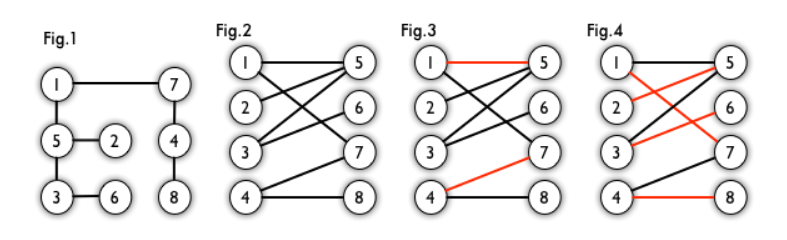
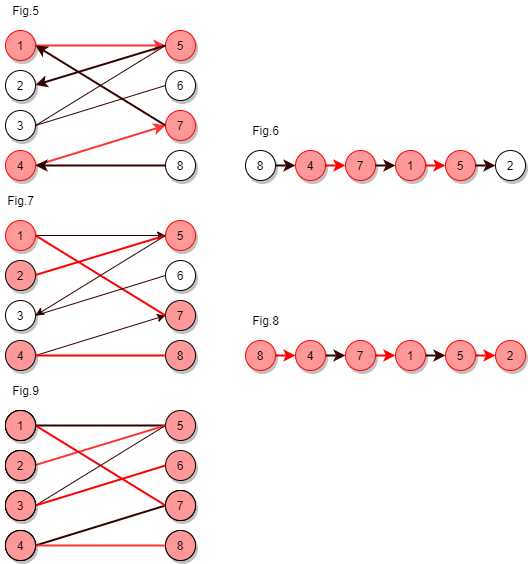
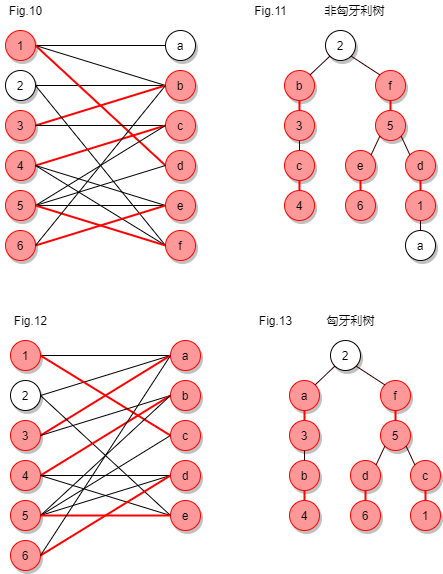

# 匈牙利算法

## 解决问题

> 二分图的最大匹配算法

## 二分图

二分图：又称作二部图，是图论中的一种特殊模型。 设G=(V,E)是一个无向图，如果顶点V可分割为两个互不相交的子集(A,B)，并且图中的每条边所关联的两个顶点i和j分别属于这两个不同的顶点集(i∈A, j∈B)，则称图G为一个二分图。

> 如果图中所有顶点可以被分为两个集合，图中所有的边的头和尾不属于同一个顶点集合，而是跨越两个集合，则这个图是一个二分图



图 1 是一个二分图

为了清晰，我们以后都把它画成图 2 的形式。 其中[1,2,3,4]互不相连，[5,6,7,8]互不相连

## 匹配

> 在图论中，「匹配」（matching）是一个边的集合，其中任意两条边都没有公共顶点。

例如，图 3、图 4 中红色的边就是图 2 的匹配。

## 最大匹配

> 一个图所有匹配中，所含匹配边数最多的匹配，称为这个图的最大匹配。

图 4 是一个最大匹配，它包含 4 条匹配边。

## 完美匹配

> 如果一个图的某个匹配中，所有的顶点都是匹配点，那么它就是一个完美匹配。完美匹配一定是最大匹配（完美匹配的任何一个点都已经匹配，添加一条新的匹配边一定会与已有的匹配边冲突），但并非每个图都存在完美匹配。

## 交替路径

> 从一个未匹配点出发，依次经过非匹配边、匹配边、非匹配边…形成的路径称为交替路径。

## 增广路径

> 从一个未匹配点出发，走交替路，如果途径另一个未匹配点（出发的点不算），则这条交替路称为增广路（agumenting path）。

特性：

1. P的路径长度必定为奇数，第一条边和最后一条边都不属于M，因为两个端点分属两个集合，且未匹配。
2. P经过取反操作可以得到一个更大的匹配M’。
3. M为G的最大匹配当且仅当不存在相对于M的增广路径。

## 匈牙利算法

> 利用增广路径求二分图的最大匹配算法称作匈牙利算法。（匈牙利数学家Edmonds于1965年提出）

### 思路

通过寻找增广路径，把增广路径中的匹配边和非匹配边的相互交换，这样就会多出一条匹配边，直到找不到增广路径为止。

### 要点

1. 从左边第 1 个顶点开始，挑选未匹配点进行搜索，寻找增广路。
    - 如果经过一个未匹配点，说明寻找成功。更新路径信息，匹配边数 +1，停止搜索。
    - 如果一直没有找到增广路，则不再从这个点开始搜索。事实上，此时搜索后会形成一棵匈牙利树。我们可以永久性地把它从图中删去，而不影响结果。
2. 由于找到增广路之后需要沿着路径更新匹配，所以我们需要一个结构来记录路径上的点。
    - DFS 版本通过函数调用隐式地使用一个栈，
    - BFS 版本使用 prev 数组。

### 举例



对于图2，他的匹配图为图5。 则增广路径为图6。

```text
设匹配点为[1,5,4,7],
匹配路径为 1 <-> 5 , 4 <-> 7
增广路径为 8 -> 4 -> 7 -> 1 -> 5 -> 2 
其中，
8：未匹配点
8 -> 4 非匹配边
4 -> 7 匹配边
7 -> 1 非匹配边
1 -> 5 匹配边
5 -> 2 非匹配边
2：非匹配点
```

增广路有一个重要特点：非匹配边比匹配边多一条。因此，研究增广路的意义是**改进匹配**。

如图7，只要把增广路中的匹配边和非匹配边的身份交换即可。

由于中间的匹配节点不存在其他相连的匹配边，所以这样做不会破坏匹配的性质。交换后，图中的匹配边数目比原来多了 1 条。

此时非匹配节点为`[3,6]`，从`3`或者`6`出发都找不到增广路径。

且如图9所示，`3`,`6`连接可以成为图7的匹配边。所以最大匹配为图9。

## 匈牙利树

> 从一个未匹配点出发运行 BFS，直到不能再扩展为止。

### 特点

1. 必须走交替路
2. 所有叶子节点均为匹配点

### 举例



如图10，可以得到图11的一颗BFS树。这棵树存在一个叶子节点为非匹配点`a`，所以它不是一颗匈牙利树

如图12，可以得到图13的一颗BFS树。这棵树是一颗匈牙利树。

## 代码实现

<p>今天和大家一起去游乐场玩，终于可以坐上梦寐以求的过山车了。</p>

<p>可是，过山车的每一排只有两个座位，而且还有条不成文的规矩，就是每个女生必须找1个男生做partner和她同坐。</p>

<p>但是，每个女孩都有各自的想法，举个例子，</p>

<p>Rabbit只愿意和XHD或PQK做partner</p>

<p>Grass只愿意和linle或LL做partner</p>

<p>PrincessSnow愿意和水域浪子或伪酷儿做partner。</p>

<p>考虑到经费问题，boss刘决定只让找到partner的人去坐过山车，其他的人，嘿嘿，就站在下面看着吧。</p>

<p>你可以帮忙算算最多有多少对组合可以坐上过山车吗？</p>

<p><strong>Input：</strong></p>

<pre>
输入数据的第一行是 M , N，分别表示女生的人数，男生的人数。

<strong>0 < K <= 1000</strong>
<strong>1 <= N,M <= 500</strong>

接下来的K行，每行有两个数，分别表示女生Ai愿意和男生Bj做partner。
</pre>

<p><strong>示例 1：</strong></p>

<pre><strong>输入：</strong>
m=3 n=3
1 1
1 2
1 3
2 1
2 3
3 1
<strong>输出：3</strong>
</pre>

### DFS

```java
class Solution {
    /**
     * 女生数
     */
    int m;
    /**
     * 男生数
     */
    int n;
    /**
     * 第i个男生被哪个女生匹配了. -1表示还没有对象
     */
    int[] boys;
    /**
     * 当前女生是否已经与第i个男生配对过，避免死循环(每个女生都要初始化一次)
     */
    boolean[] vis;
    /**
     * (i,j) = 1表示第i个女生可以和第j个男生搭配
     */
    int[][] lines;

    /**
     *
     * @param m      女生人数
     * @param n      男生人数
     * @param map 关系图
     * @return 关系数
     */
    public int hungary(int m, int n, int[][] map) {
        this.m = m;
        this.n = n;
        this.vis = new boolean[n + 1];
        this.boys = new int[n + 1];
        this.lines = new int[m + 1][n + 1];

        Arrays.fill(boys, -1);

        for (int[] temp : map) {
            lines[temp[0]][temp[1]] = 1;
        }

        int res = 0;
        for (int i = 1; i <= m; i++) {
            Arrays.fill(vis, false);
            if (dfs(i)) {
                //成功找到一个新的增广路径
                res++;
            }
        }
        return res;
    }

    /**
     * 第x个女生是否存在增广路径
     * @param x 女生
     * @return 是否有增广路径
     */
    public boolean dfs(int x) {
        //扫描每一个男生
        for (int j = 1; j <= n; j++) {
            // 要求不在交替路中: 若女生x曾试图找男生j作搭档，此次就没机会了
            if (!vis[j] && lines[x][j] == 1) {
                vis[j] = true;// 放入交替路
                // 这个男生没有匹配到女生 ，或者匹配到的这个女生有其他男生可以匹配。
                if (boys[j] == -1 || dfs(boys[j])) {
                    boys[j] = x;
                    return true;
                }
            }
        }
        return false;
    }
}
```

### BFS

```java
class Solution {
    /**
     * 女生数
     */
    int m;
    /**
     * 男生数
     */
    int n;
    /**
     * 第j个男生被哪个女生匹配了. -1表示还没有对象
     */
    int[] boys;
    /**
     * 第i个女生被哪个男生匹配了. -1表示还没有对象
     */
    int[] girls;
    /**
     * 当前男生匹配的对象是哪个女生 vis[j]=x代表被使用过了
     */
    int[] vis;

    /**
     * (i,j) = 1表示第i个女生可以和第j个男生搭配
     */
    int[][] lines;

    /**
     * 前节点，-1表示根节点
     */
    int[] prev;

    /**
     * @param m   女生人数
     * @param n   男生人数
     * @param map 关系图
     * @return 关系数
     */
    public int domino(int m, int n, int[][] map) {
        this.m = m;
        this.n = n;
        this.vis = new int[n + 1];
        this.boys = new int[n + 1];
        this.girls = new int[m + 1];
        this.lines = new int[m + 1][n + 1];
        this.prev = new int[m + 1];
        Arrays.fill(boys, -1);
        Arrays.fill(girls, -1);
        Arrays.fill(vis, -1);
        for (int[] temp : map) {
            lines[temp[0]][temp[1]] = 1;
        }
        int res = 0;
        for (int i = 1; i <= m; i++) {
            if (bfs(i)) {
                //成功找到一个新的增广路径
                res++;
            }
        }
        return res;
    }

    public boolean bfs(int x) {
        // 如果没有连接的男的
        if (girls[x] == -1) {
            Queue<Integer> queue = new ArrayDeque<>();
            //塞入队列，等待连接
            queue.add(x);
            // 设x为起始路径
            prev[x] = -1;
            // 尚未找到增广路
            boolean flag = false;
            while (!queue.isEmpty() && !flag) {
                int i = queue.peek();
                queue.poll();
                for (int j = 1; j <= n; j++) {
                    //注意，是vis[j]=x，而不是=i
                    if (vis[j] != x && lines[i][j] == 1) {
                        vis[j] = x;
                        if (boys[j] >= 0) {
                            //如果j被别人连了，就要调整对应的i
                            queue.add(boys[j]);
                            // 在已匹配点
                            prev[boys[j]] = i;
                        } else {
                            // 找到未匹配点，交替路变为增广路
                            flag = true;
                            while (i != -1) {
                                //找到一个未匹配点，不断往回更新，让他们重选下一个
                                int t = girls[i];
                                girls[i] = j;
                                boys[j] = i;
                                i = prev[i];
                                j = t;
                            }
                            break;
                        }
                    }
                }
            }
            return girls[x] > 0;
        }
        return false;
    }
}
```