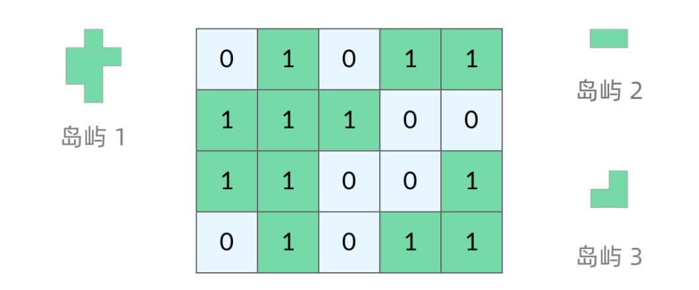
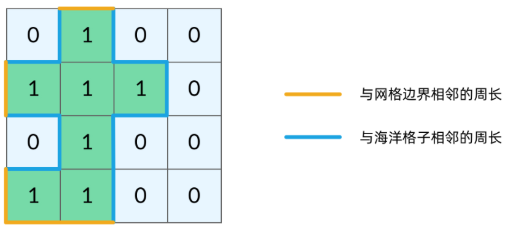

# 岛屿（网格）问题

- [本质](#本质)
- [基本概念](#基本概念)
  - [网格的基本概念](#网格的基本概念)
- [DFS](#dfs)
  - [DFS的基本结构](#dfs的基本结构)
  - [网格的DFS](#网格的dfs)
  - [如何避免重复遍历](#如何避免重复遍历)
    - [3色标记法：标记已经遍历过的格子（题目允许修改原数组）](#3色标记法标记已经遍历过的格子题目允许修改原数组)
    - [记忆化搜索：标记数组记录（题目要求不能修改原数组）](#记忆化搜索标记数组记录题目要求不能修改原数组)
- [系列问题](#系列问题)
  - [P200_岛屿数量](#p200_岛屿数量)
    - [题目](#题目)
    - [题解](#题解)
  - [P463_岛屿的周长](#p463_岛屿的周长)
    - [题目](#题目-1)
    - [题解](#题解-1)
  - [P695_岛屿的最大面积](#p695_岛屿的最大面积)
    - [题目](#题目-2)
    - [题解](#题解-2)
  - [P827_最大人工岛](#p827_最大人工岛)
    - [题目](#题目-3)
    - [题解](#题解-3)

## 本质

深度优先搜索DFS

## 基本概念

### 网格的基本概念

网格问题是由 m×n 个小方格组成一个网格，每个小方格与其上下左右四个方格认为是相邻的，每个格子中的数字可能是 0（海洋） 或者 1（陆地），相邻的陆地格子看成一个岛屿。



## DFS

### DFS的基本结构

二叉树的DFS

```java
class Solution {
    void traverse(TreeNode root) {
        // 判断 base case
        if (root == null) {
            return;
        }
        // 访问两个相邻结点：左子结点、右子结点
        traverse(root.left);
        traverse(root.right);
    }
}
```

在二叉树中，DFS的两个要素为：

1. __base case__：DFS循环结束（不需要继续遍历）的条件。
    - 结束循环：`root == null`
    - 防止空指针：`root.left`和`root.right`不会出现空指针
2. __访问相邻结点__：深度搜索的实际操作
    - 访问左子树：`traverse(root.left)`
    - 访问右子树：`traverse(root.right)`

### 网格的DFS

相对应的，在网格中。对于坐标 __(row,col)__ 以下简记为 __(r,c)__

1. __base case__：DFS循环结束（不需要继续遍历）的条件。
    - 结束循环：坐标超出了网格范围 `!(r >= 0 && r < grid.length && c >= 0 && c < grid[0].length)`
    - 防止空指针：grid[r][c]不会下标越界
2. __访问相邻结点__：深度搜索的实际操作
    - 访问上节点：`dfs(grid, r - 1, c)`
    - 访问下节点：`dfs(grid, r + 1, c)`
    - 访问左节点：`dfs(grid, r, c - 1)`
    - 访问右节点：`dfs(grid, r, c + 1)`

```java
class Solution {
    void dfs(int[][] grid, int r, int c) {
        // 判断 base case：如果坐标 (r, c) 超出了网格范围，直接返回
        if (!(r >= 0 && r < grid.length && c >= 0 && c < grid[0].length)) {
            return;
        }
        // 访问上、下、左、右四个相邻结点
        dfs(grid, r - 1, c);
        dfs(grid, r + 1, c);
        dfs(grid, r, c - 1);
        dfs(grid, r, c + 1);
    }
}
```

### 如何避免重复遍历

网格结构的 DFS 与二叉树的 DFS 最大的不同之处在于，遍历中可能遇到遍历过的结点。这是因为，网格结构本质上是一个「图」，我们可以把每个格子看成图中的结点，每个结点有向上下左右的四条边。在图中遍历时，自然可能遇到重复遍历结点。

#### 3色标记法：标记已经遍历过的格子（题目允许修改原数组）

3色标记法：

- __0__ —— 海洋格子
- __1__ —— 陆地格子（未遍历过）
- __2__ —— 陆地格子（已遍历过）

```java
class Solution {
    void dfs(int[][] grid, int r, int c) {
        // 判断 base case：如果坐标 (r, c) 超出了网格范围，直接返回
        if (!(r >= 0 && r < grid.length && c >= 0 && c < grid[0].length)) {
            return;
        }
        // 如果这个格子不是岛屿，直接返回
        if (grid[r][c] != 1) {
            return;
        }
        // 将格子标记为「已遍历过」
        grid[r][c] = 2;
        // 访问上、下、左、右四个相邻结点
        dfs(grid, r - 1, c);
        dfs(grid, r + 1, c);
        dfs(grid, r, c - 1);
        dfs(grid, r, c + 1);
    }
}
```

#### 记忆化搜索：标记数组记录（题目要求不能修改原数组）

新建标记坐标数组 `boolean[][] visited = new boolean[grid.length][grid[0].length];`

```java
class Solution {
    void dfs(int[][] grid, int r, int c, boolean[][] visited) {
        // 判断 base case：如果坐标 (r, c) 超出了网格范围，直接返回
        if (!(r >= 0 && r < grid.length && c >= 0 && c < grid[0].length)) {
            return;
        }
        // 如果当前坐标已经被标记，或者是海洋，直接返回
        if (visited[x][y] || grid[x][y] == '0') {
            return;
        }
        // 将格子标记为「已遍历过」
        grid[r][c] = 2;
        // 访问上、下、左、右四个相邻结点
        dfs(grid, r - 1, c);
        dfs(grid, r + 1, c);
        dfs(grid, r, c - 1);
        dfs(grid, r, c + 1);
    }
}
```

## 系列问题

| 难度  | 题目 | 题解 | 代码 | 掌握度 |
| :---: | :--- | :--- | :--- | :---: |
| 💛 | [P200_岛屿数量](./../content/P200_NumberOfIslands.md) |                | [P200_NumberOfIslands.java](./../../P200_NumberOfIslands.java) |   😄    |
| 💚 | [P463_岛屿的周长](./../content/P463_IslandPerimeter.md) |                | [P463_IslandPerimeter.java](../../../P463_IslandPerimeter.java) |   😄    |
| 💛 | [P695_岛屿的最大面积 ](./../content/P695_MaxAreaOfIsland.md) |                | [.java](../../../P695_MaxAreaOfIsland.java) |   😄    |
| ❤️   | [P827_最大人工岛](./../content/P827_MakingALargeIsland.md) |                | [P827_MakingALargeIsland.java](../../../P827_MakingALargeIsland.java) |   😄    |
| 💛 | [P1034_边界着色](./../content/P1034_ColoringABorder.md) | ❓ 题目在说啥啊 | [P1034_ColoringABorder.java](./../../P1034_ColoringABorder.java) |   😄    |

### P200_岛屿数量

#### 题目

<pre>

<p>给你一个由 <code>'1'</code>（陆地）和 <code>'0'</code>（水）组成的的二维网格，请你计算网格中岛屿的数量。</p>

</pre>

#### 题解

```java
class Solution {
     public int numIslands(char[][] grid) {
         if (grid == null || grid.length == 0) {
             return 0;
         }
         int m = grid.length, n = grid[0].length;
         boolean[][] visited = new boolean[m][n];
         int ans = 0;
         for (int i = 0; i < m; i++) {
             for (int j = 0; j < n; j++) {
                 // 只有 1 且 未被访问过的坐标 需要检索
                 if (grid[i][j] == '1' && !visited[i][j]) {
                     ans++;
                     dfs(grid, i, j, visited);
                 }
             }
         }
         return ans;
     }

     private void dfs(char[][] grid, int row, int col, boolean[][] visited) {
         // 判断 base case：如果坐标 (row, col) 超出了网格范围，直接返回
         if (!(row >= 0 && row < grid.length && col >= 0 && col < grid[0].length)) {
             return;
         }
         // 如果当前坐标已经被标记，或者是海洋，直接返回
         if (visited[row][col] || grid[row][col] == '0') {
             return;
         }
         visited[row][col] = true;
         // 4个方向
         dfs(grid, row - 1, col, visited);
         dfs(grid, row + 1, col, visited);
         dfs(grid, row, col - 1, visited);
         dfs(grid, row, col + 1, visited);
     }
 }
```

### P463_岛屿的周长

#### 题目

<pre>

<p>给定一个 <code>row x col</code> 的二维网格地图 <code>grid</code> ，其中：<code>grid[i][j] = 1</code> 表示陆地， <code>grid[i][j] = 0</code> 表示水域。</p>

<p>网格中的格子 <strong>水平和垂直</strong> 方向相连（对角线方向不相连）。整个网格被水完全包围，但其中恰好有一个岛屿（或者说，一个或多个表示陆地的格子相连组成的岛屿）。</p>

<p>岛屿中没有“湖”（“湖” 指水域在岛屿内部且不和岛屿周围的水相连）。格子是边长为 1 的正方形。网格为长方形，且宽度和高度均不超过 100 。计算这个岛屿的周长。</p>

</pre>

#### 题解

将岛屿的周长中的边分为两类，如下图所示。

- 黄色的边是与网格边界相邻的周长
- 蓝色的边是与海洋格子相邻的周长。



```java
class Solution {
     public int islandPerimeter(int[][] grid) {
         if (grid == null || grid.length == 0) {
             return 0;
         }
         boolean[][] visited = new boolean[grid.length][grid[0].length];
         for (int i = 0; i < grid.length; i++) {
             for (int j = 0; j < grid[0].length; j++) {
                 if (grid[i][j] == 1 && !visited[i][j]) {
                     // 题目限制只有一个岛屿，计算一个即可
                     return dfs(grid, i, j, visited);
                 }
             }
         }
         return 0;
     }

     /**
      * 将岛屿的周长中的边分为两类
      * 1. 与网格边界相邻的周长，
      * 2. 与海洋格子相邻的周长。
      */
     private int dfs(int[][] grid, int row, int col, boolean[][] visited) {
         // 判断 base case：如果坐标 (row, col) 超出了网格范围，对应与网格边界相邻的周长。
         if (!(row >= 0 && row < grid.length && col >= 0 && col < grid[0].length)) {
             return 1;
         }
         // 当前坐标是海洋，对应与海洋格子相邻的周长。
         if (grid[row][col] == 0) {
             return 1;
         }
         // 已经遍历过的不用再遍历
         if (visited[row][col]) {
             return 0;
         }
         visited[row][col] = true;
         // 4个方向
         return dfs(grid, row - 1, col, visited)
                 + dfs(grid, row + 1, col, visited)
                 + dfs(grid, row, col - 1, visited)
                 + dfs(grid, row, col + 1, visited);
     }
 }
```


### P695_岛屿的最大面积

#### 题目

<pre>

<p>给你一个大小为 <code>m x n</code> 的二进制矩阵 <code>grid</code> 。</p>

<p><strong>岛屿</strong>&nbsp;是由一些相邻的&nbsp;<code>1</code>&nbsp;(代表土地) 构成的组合，这里的「相邻」要求两个 <code>1</code> 必须在 <strong>水平或者竖直的四个方向上 </strong>相邻。你可以假设&nbsp;<code>grid</code> 的四个边缘都被 <code>0</code>（代表水）包围着。</p>

<p>岛屿的面积是岛上值为 <code>1</code> 的单元格的数目。</p>

<p>计算并返回 <code>grid</code> 中最大的岛屿面积。如果没有岛屿，则返回面积为 <code>0</code> 。</p>

</pre>

#### 题解

```java
class Solution {
     public int maxAreaOfIsland(int[][] grid) {
         if (grid == null || grid.length == 0) {
             return 0;
         }
         int ans = 0;
         boolean[][] visited = new boolean[grid.length][grid[0].length];
         for (int i = 0; i < grid.length; i++) {
             for (int j = 0; j < grid[0].length; j++) {
                 if (grid[i][j] == 1 && !visited[i][j]) {
                     int area = dfs(grid, i, j, visited);
                     ans = Math.max(ans, area);
                 }
             }
         }
         return ans;
     }

     private int dfs(int[][] grid, int row, int col, boolean[][] visited) {
         // 判断 base case：如果坐标 (row, col) 超出了网格范围，直接返回
         if (!(row >= 0 && row < grid.length && col >= 0 && col < grid[0].length)) {
             return 0;
         }
         // 如果当前坐标已经被标记，或者是海洋，直接返回
         if (visited[row][col] || grid[row][col] == 0) {
             return 0;
         }
         visited[row][col] = true;
         // 4个方向
         return 1 + dfs(grid, row - 1, col, visited)
                 + dfs(grid, row + 1, col, visited)
                 + dfs(grid, row, col - 1, visited)
                 + dfs(grid, row, col + 1, visited);
     }
 }
```

### P827_最大人工岛

#### 题目

<pre>

<p>给你一个大小为 <code>n x n</code> 二进制矩阵 <code>grid</code> 。<strong>最多</strong> 只能将一格 <code>0</code> 变成 <code>1</code> 。</p>

<p>返回执行此操作后，<code>grid</code> 中最大的岛屿面积是多少？</p>

<p><strong>岛屿</strong> 由一组上、下、左、右四个方向相连的 <code>1</code> 形成。</p>

</pre>

#### 题解

P695_岛屿的最大面积的升级版


1. 很容易想到第一个DFS：计算所有岛屿的面积，存入数组
2. 0 变成 1 之后，如果能够连接岛屿，则必须是两片不一样的岛屿，所以需要对岛屿进行编号。

```java
class Solution {
     private int n;
     // 几号岛屿多大
     private int[] areas;
     // 岛屿编号
     private int islandNo = 2;
     // 坐标是否已标记
     boolean[][] visited;
     // 水域坐标
     int[][] water;
     // 水域下标
     int waterIndex = -1;

     /**
      * 求最大人工岛
      *
      * @param grid grid
      * @return 最大值
      */
     public int largestIsland(int[][] grid) {
         if (grid == null || grid.length == 0) {
             return 0;
         }

         this.n = grid.length;
         // 避开编号0,1
         this.areas = new int[n * n + 2];
         this.visited = new boolean[n][n];
         this.water = new int[n * n][2];
         // 给岛编号，同时收录水域
         codeGrid(grid);
         // 全是陆地
         if (waterIndex == -1) {
             return n * n;
         }
         // 全是水
         if (waterIndex == n * n) {
             return 1;
         }
         int ans = 0;
         while (waterIndex >= 0) {
             int row = water[waterIndex][0];
             int col = water[waterIndex][1];
             int curArea = 0;
             int no1 = neighborsIslandNo(grid, row + 1, col);
             curArea += areas[no1];

             int no2 = neighborsIslandNo(grid, row - 1, col);
             if (no2 != no1) {
                 curArea += areas[no2];
             }
             int no3 = neighborsIslandNo(grid, row, col - 1);
             if (no3 != no1 && no3 != no2) {
                 curArea += areas[no3];
             }
             int no4 = neighborsIslandNo(grid, row, col + 1);
             if (no4 != no1 && no4 != no2 && no4 != no3) {
                 curArea += areas[no4];
             }
             ans = Math.max(ans, curArea);
             waterIndex--;
         }
         // 补上造陆的那一块
         return ans + 1;
     }
     /**
      * 给地图编码
      *
      * @param grid grid
      */
     private void codeGrid(int[][] grid) {
         for (int row = 0; row < n; row++) {
             for (int col = 0; col < n; col++) {
                 if (!visited[row][col]) {
                     if (grid[row][col] == 0) {
                         markWater(row, col);
                     } else if (grid[row][col] == 1) {
                         // 因为在dfs中，会修改grid[row][col]的值，所以需要判断grid[row][col] == 1
                         this.areas[islandNo] = dfs(grid, row, col, islandNo);
                         islandNo++;
                     }
                 }
             }
         }
     }
     /**
      * 计算面积并标记坐标
      *
      * @param grid     grid
      * @param row      row
      * @param col      col
      * @param islandNo 岛屿编号
      * @return 面积
      */
     private int dfs(int[][] grid, int row, int col, int islandNo) {
         // 判断 base case：如果坐标 (row, col) 超出了网格范围，直接返回
         if (!inGrid(row, col) || visited[row][col]) {
             return 0;
         }
         // 如果当前坐标已经被标记，或者是海洋，直接返回
         if (grid[row][col] == 0) {
             markWater(row, col);
             return 0;
         }
         visited[row][col] = true;
         // 将岛屿的值替换成对应的岛屿编号
         grid[row][col] = islandNo;
         // 4个方向
         return 1 + dfs(grid, row - 1, col, islandNo)
                 + dfs(grid, row + 1, col, islandNo)
                 + dfs(grid, row, col - 1, islandNo)
                 + dfs(grid, row, col + 1, islandNo);
     }
     /**
      * 岛屿的编号
      *
      * @param grid grid
      * @param row  row
      * @param col  col
      * @return 岛屿的编号 ,如果是水，返回 0
      */
     private int neighborsIslandNo(int[][] grid, int row, int col) {
         if (inGrid(row, col)) {
             return grid[row][col];
         }
         return 0;
     }
     /**
      * 标记水域的坐标
      *
      * @param row row
      * @param col col
      */
     private void markWater(int row, int col) {
         visited[row][col] = true;
         waterIndex++;
         water[waterIndex][0] = row;
         water[waterIndex][1] = col;
     }
     /**
      * 当前坐标是否在图中
      *
      * @param row row
      * @param col col
      * @return 当前坐标是否在图中
      */
     private boolean inGrid(int row, int col) {
         return row >= 0 && row < n && col >= 0 && col < n;
     }

 }
```

