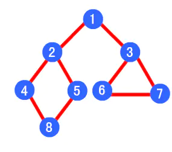

# 树的解题套路总结

## 二叉树

### 树的结构

```java
public class TreeNode {
    int val;
    TreeNode left;
    TreeNode right;

    TreeNode() {
    }

    TreeNode(int val) {
        this.val = val;
    }

    TreeNode(int val, TreeNode left, TreeNode right) {
        this.val = val;
        this.left = left;
        this.right = right;
    }
}
```

### 树的遍历

#### 前序遍历

```java
class Solution {
    public void preOrder(TreeNode node) {
        if (node == null) {
            return;
        }
        // do something...
        preOrder(node.left);
        preOrder(node.right);
    }
}
```

#### 中序遍历

```java
class Solution {
    public void inOrder(TreeNode node) {
        if (node == null) {
            return;
        }
        inOrder(node.left);
        //do something...
        inOrder(node.right);
    }
}
```

#### 后序遍历

```java
class Solution {
    public void postOrder(TreeNode node) {
        if (node == null) {
            return;
        }
        postOrder(node.left);
        postOrder(node.right);
        //do something...
    }
}
```

#### 前序、中序、后序遍历

前序、中序、后序遍历的区别在于是访问根节点的顺序：

- 前序：根、左、右
- 中序：左、根、右
- 后序：左、右、根

```java
/**
 * 通用模板如下
 */
class Solution {
    public void traverse(TreeNode node) {
        if (node == null) {
            return;
        }
        // 前序遍历 do something ...
        traverse(node.left);
        // 中序遍历 do something ...
        traverse(node.right);
        // 后序遍历 do something ...
    }
}
```

由上可知，两种遍历组合可以推导出树的结构

- 前序+中序。如算法[P105_从前序与中序遍历序列构造二叉树](../content/P105_ConstructBinaryTreeFromPreorderAndInorderTraversal.md)
- 中序+后序。如算法[P106_从中序与后序遍历序列构造二叉树](../content/P106_ConstructBinaryTreeFromInorderAndPostorderTraversal.md)

思路如下：

1. 前序遍历的第一个节点为根节点。根据该根节点，可以将中序遍历的结构切割成两部分。左边为根节点的左子树，右边为根节点的右子树。
2. 根据左、右子树中序遍历的长度，可以将前序遍历切割成左、右子树对应的前序遍历。
3. 根据左、右子树的前序遍历+中序遍历，可以递归，继续切割，推导下一层级的子树。
4. 递归得到树的结构

#### 层序遍历

```java
class Solution {
    public void levelOrder(TreeNode root) {
        System.out.println();
        List<List<Integer>> ans = new ArrayList<>();
        levelRecursion(root, ans, 0);
        ans.stream().forEach(it -> it.stream().forEach(item -> System.out.print(item + " ")));
        System.out.println();

    }

    private void levelRecursion(TreeNode node, List<List<Integer>> ans, int level) {
        if (node == null) {
            return;
        }
        if (ans.size() < level + 1) {
            ans.add(new ArrayList<>());
        }
        ans.get(level).add(node.val);
        levelRecursion(node.left, ans, level + 1);
        levelRecursion(node.right, ans, level + 1);
    }
}
```

#### 树的深度

```java
class Solution {
    public int maxDepth(TreeNode root) {
        if (root == null) {
            return 0;
        }
        int left = maxDepth(root.left);
        int right = maxDepth(root.right);
        return Math.max(left, right) + 1;
    }
}
```

### DFS与BFS

#### 深度优先搜索（DFS）

步骤：

1. 访问顶点v
2. 依次从v的未被访问的邻接点出发，对图进行深度优先遍历；直至图中和v有路径相通的顶点都被访问；
3. 若此时图中尚有顶点未被访问，则从一个未被访问的顶点出发，重新进行深度优先遍历，直到图中所有顶点均被访问过为止。

例如下图，其深度优先遍历顺序为 1->2->4->8->5->3->6->7



#### 广度优先搜索（BFS）

步骤：

1. 首先将根节点放入队列中。
2. 从队列中取出第一个节点，并检验它是否为目标。如果找到目标，则结束搜寻并回传结果。否则将它所有尚未检验过的直接子节点加入队列中。
3. 若队列为空，表示整张图都检查过了——亦即图中没有欲搜寻的目标。结束搜寻并回传“找不到目标”。 重复步骤2。

例如下图，其广度优先算法的遍历顺序为：1->2->3->4->5->6->7->8


## N叉树

### 数据结构

```java
/* 基本的 N 叉树节点 */
class TreeNode {
    int val;
    TreeNode[] children;

    void traverse(TreeNode root) {
        for (TreeNode child : root.children) {
            traverse(child);
        }
    }
}
```